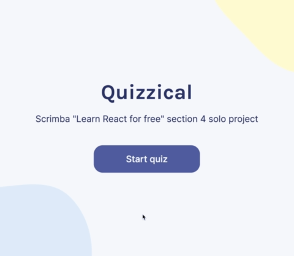

# Quizzical




This is the fourth module's solo project of Scrimba's [Learn React for free](https://scrimba.com/learn/learnreact) course.

## Requirements
- Two screens (start & questions)
- Pull 5 questions from the [Open Trivia Database API](https://opentdb.com/api_config.php)
- Tally correct answers after "Check answers" is clicked
- Styled & Polished ([Figma design reference](https://www.figma.com/file/E9S5iPcm10f0RIHK8mCqKL/Quizzical-App))

---


## Run in development mode
```
npm start
```

## Build for production
```
npm run build
```

This project was bootstrapped with [Create React App](https://github.com/facebook/create-react-app)